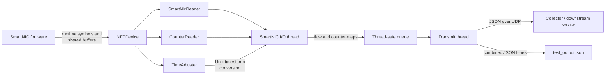

# sflow_middle

## Project Overview

`sflow_middle` is a host-side middle layer between a Netronome/NFP SmartNIC and
an external sFlow collector or processing service. The SmartNIC firmware stores
flow samples and interface counters in exported memory regions; this program
reads those records through the Netronome CPP interface, converts SmartNIC
timestamps to Unix time, groups the data, and exports it as JSON over UDP.

The project handles records that have already been produced by the SmartNIC
data path. It is not a decoder for raw sFlow network datagrams.

## Architecture



The application is divided into the following main components:

- **`NFPDevice`** owns the Netronome device and CPP handles. It also
  caches the firmware runtime-symbol table so shared-memory locations can be
  resolved by name.
- **`SmartNicReader`** reads flow keys and statistics from a semaphore-managed,
  double-buffered SmartNIC memory layout. It switches the active bank, waits for
  the previous bank to become idle, collects ready entries, and clears the bank
  for reuse.
- **`CounterReader`** reads interface counter entries whose semaphore state
  marks them as ready, then clears the consumed counter storage.
- **`TimeAdjuster` and `ClockCalibration`** sample the live NBI MAC clock and the
  host clocks. They maintain an offset-and-drift model that maps hardware
  timestamps to Unix nanoseconds while rejecting high-latency or discontinuous
  samples.
- **SmartNIC I/O thread** polls once per second, refreshes clock calibration,
  groups flow records by five-tuple, associates per-agent statistics, and places
  completed batches on a shared queue.
- **Transmit thread** serializes flow and counter records with
  `nlohmann::json`, sends individual records asynchronously over UDP, and writes
  a combined JSON Lines record for local inspection.

## Simple Workflow

1. Load device, destination, runtime-symbol, and MAC-clock settings from YAML.
2. Open the selected NFP device and resolve the firmware symbols for flow
   buffers, counter buffers, buffer state, and processing state.
3. Calibrate the SmartNIC MAC clock against the host's realtime and monotonic
   clocks.
4. On each polling interval, switch the SmartNIC flow buffer and wait until the
   previous buffer is no longer being written.
5. Read ready flow and counter slots, clear consumed memory, and convert flow
   timestamps to Unix milliseconds.
6. Group flows by source/destination addresses, ports, and protocol; attach
   agent, interface, byte, packet, sampling-rate, and TCP-flag information.
7. Pass each batch through a mutex- and condition-variable-protected queue.
8. Serialize records to JSON and send them to the configured UDP destination.
9. Stop cleanly when the configured run duration expires or when `SIGINT` or
   `SIGTERM` is received.

## Data Model

Flow output contains a five-tuple, the earliest start time, the latest end time,
and one or more agent records. Each agent record includes the agent IP,
input/output interface indexes, byte and packet counts, sampling rate, TCP flags,
and the originating SmartNIC slot index.

Counter output is keyed by agent IP and interface index and contains interface
speed plus inbound and outbound octet totals. IP addresses are represented by
their 32-bit integer values, and exported flow times are Unix milliseconds.

## Key Tech Used

- **C++17** for the main application, data modeling, RAII, and concurrency.
- **Netronome NFP SDK (`libnfp`)** for device access, runtime-symbol discovery,
  CPP memory operations, and MAC-clock reads.
- **Boost.Asio** for asynchronous UDP delivery.
- **nlohmann/json** for JSON serialization.
- **yaml-cpp** for runtime configuration parsing.
- **POSIX clocks** (`CLOCK_REALTIME` and `CLOCK_MONOTONIC_RAW`) for hardware-clock
  calibration and drift tracking.
- **CMake** for project definition.
- **Standard C++ threads, mutexes, condition variables, and atomics** for the
  producer/consumer pipeline and graceful shutdown.
- **spdlog and fmt** as linked logging and formatting infrastructure.

## Configuration Surface

`setting.yaml` describes the NFP device number, process duration, UDP target,
firmware runtime-symbol names, and the NBI MAC-clock address. Keeping symbol
names configurable lets the host program follow compatible firmware builds
without hard-coding their exported addresses or memory islands.

## Project Layout

- `src/main.cpp` - process orchestration, aggregation, queueing, and UDP export.
- `src/Device.cpp` / `include/Device.hpp` - NFP device lifetime and symbol lookup.
- `src/Reader.cpp` / `include/Reader.hpp` - double-buffered flow extraction and
  flow data structures.
- `src/CounterReader.cpp` / `include/CounterReader.hpp` - interface-counter
  extraction and counter data structures.
- `src/Time.cpp` / `include/Time.hpp` - MAC-clock sampling, calibration, drift
  fitting, reset handling, and Unix-time conversion.

## Installation

compile process:

```bash
mkdir build
cd build
cmake ..
make
```